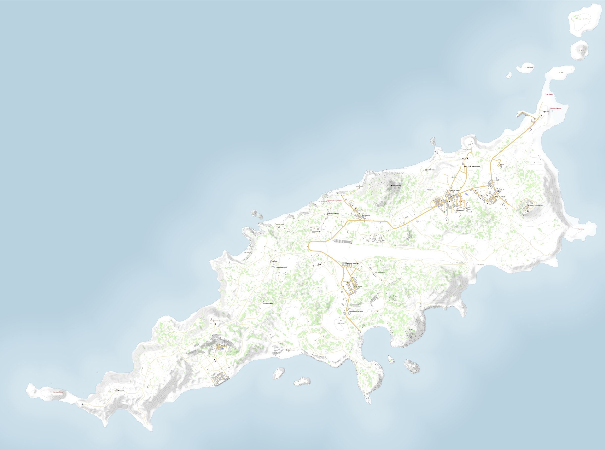
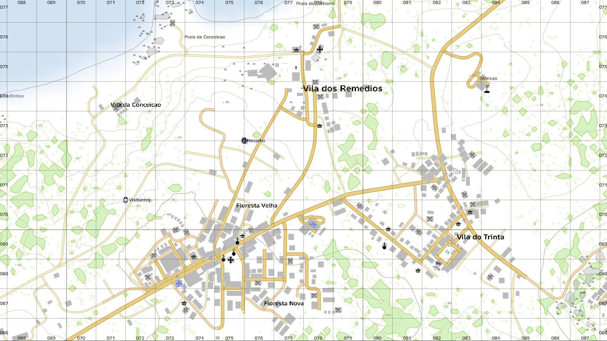
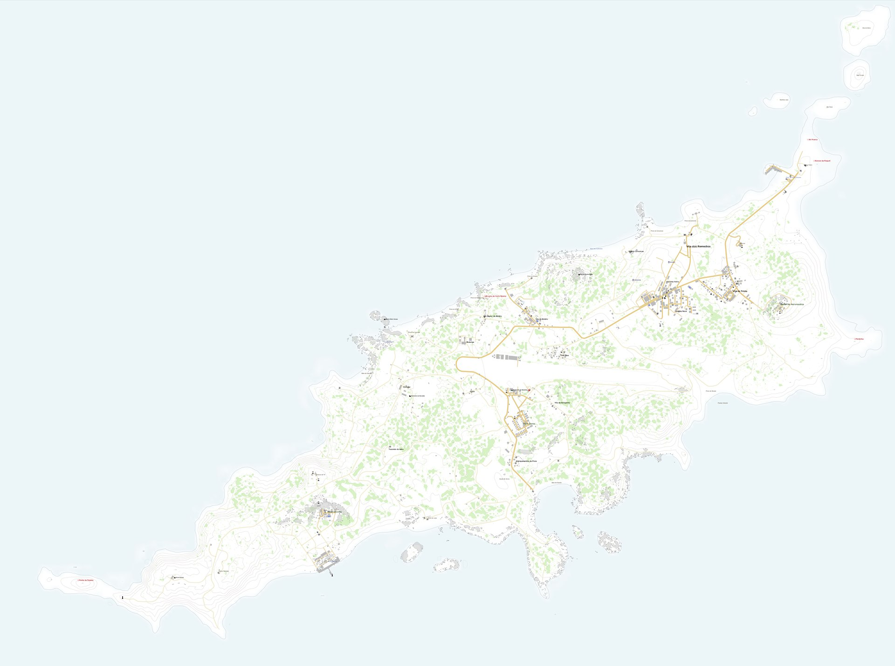

# NoronhaMapExporter

Export the native DayZ map as a high-resolution, lossless image.

**[Explore the Fernando de Noronha map →](https://adriiancoe.github.io/NoronhaMapExporter/)**

[](https://adriiancoe.github.io/NoronhaMapExporter/)

**[Download the latest release →](https://github.com/AdriianCOE/NoronhaMapExporter/releases/latest)**

I built NoronhaMapExporter while working on my [Fernando de Noronha terrain](https://steamcommunity.com/sharedfiles/filedetails/?id=3682451894). I spent far too long looking for a reliable way to export DayZ's native map at high resolution, so eventually I stopped looking and made one.

It solved my problem, so I cleaned it up for other terrain makers too. Despite the name, NoronhaMapExporter is designed for compatible vanilla and custom DayZ worlds.

## Get started

```powershell
.\setup.ps1
.\run-2d.ps1
```

**Requirements:** Windows · DayZ · DayZ Tools · Python 3 · .NET 8 SDK

`setup.ps1` finds DayZ and DayZ Tools, lets you choose Chernarus, Livonia, or a custom terrain, creates the local configuration and offline mission, and checks the required dependencies.

`run-2d.ps1` builds the exporter addon, starts DayZDiag, captures the map, and stitches the result automatically.

When DayZDiag opens:

1. Enter the generated offline mission.
2. Press `Ctrl+F8`.
3. Press `F8` once.
4. Wait for the export to finish.

The script detects completion automatically.

## What it exports

- Native DayZ `MapWidget` cartography
- Lossless stitched PNG output
- Separate overview and detail exports
- Clean cartography without the normal technical grid
- Optional tourist-map relief from an ASC heightmap
- Optional standalone source satellite export

| Native DayZ MapWidget | Clean exported map |
| --- | --- |
|  |  |

The Fernando de Noronha detail map shown above was exported at **9600 × 9600 px** from 60 native captures. The tourist version is produced separately, so the clean stitched master remains untouched.

## Custom terrains

`setup.ps1` is the recommended setup path. For manual configuration or advanced changes, see [`config.example.json`](config.example.json).

A minimal custom-terrain configuration looks like this:

```json
{
  "paths": {
    "terrainMod": "D:/DayZMods/@MyTerrain",
    "mission": "./mission/dayzOffline.MyTerrain"
  },
  "world": {
    "name": "MyTerrain",
    "size": 10240
  }
}
```

`world.name` is the DayZ world/config name, not the Steam Workshop display name. `world.size` is the terrain width in metres, not pixels. For an installed vanilla world, `terrainMod` can be `null`.

## Compatibility

NoronhaMapExporter is designed around DayZ's native `MapWidget` and is not tied to a single terrain.

Runtime tested with:

- **Fernando de Noronha** — custom terrain
- **Chernarus** — `ChernarusPlus`
- **Livonia** — `Enoch`

Other compatible installed and custom worlds should use the same pipeline, although not every terrain has been individually runtime-tested.

## Output

```text
output/<world>/2d/overview.png
output/<world>/2d/detail.png
output/<world>/tourist/
output/<world>/satmap/
```

The clean 2D export is the primary output. Tourist relief and satellite output are optional and are written separately.

## Tourist map, hillshade and satellite

The optional tourist pipeline can add terrain relief without modifying the clean 2D master. It uses the terrain's authoritative ASC heightmap for slope-weighted multidirectional hillshade, subtle cliff emphasis, coastline treatment, and ocean-distance shading.

The public defaults live in [`config.example.json`](config.example.json) and are intentionally conservative so roads, buildings, vegetation, labels, and native contour lines remain readable.

Satellite export is separate from the MapWidget pipeline and uses an explicit source raster. Neither tourist relief nor satellite output is required for a normal 2D export.

## FAQ

**Can I export at a higher resolution?**  
Yes. Lower `MapWidget` scales produce more captures and a larger final image. This is native engine rendering rather than artificial upscaling, although more pixels do not always reveal additional DayZ map detail.

**Does it work on Linux?**  
The full capture workflow currently requires Windows because it depends on DayZDiag, DayZ Tools, and the Windows capture helper. Offline Python processing may work elsewhere; Wine and Proton are untested and unsupported.

## Requirements

- Windows
- DayZ
- DayZ Tools
- Python 3
- Pillow and NumPy
- .NET 8 SDK

Install the Python dependencies with:

```powershell
python -m pip install -r .\stitcher\requirements.txt
```

For implementation details, see [Architecture](docs/ARCHITECTURE.md).

## License

Project-authored code and documentation are available under the MIT license. See [LICENSE](LICENSE).

Leaflet 1.9.4 is bundled under its BSD 2-Clause license in
[`web/vendor/leaflet/LICENSE`](web/vendor/leaflet/LICENSE). Preview images show
project output and do not relicense DayZ, Bohemia, or third-party terrain assets.
